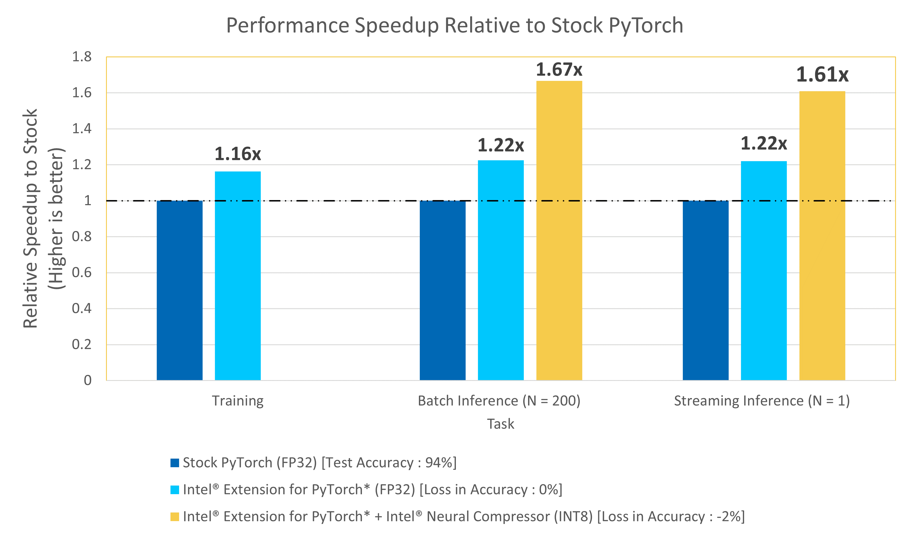

# **PyTorch Conversational AI Chatbot for Customer Care**
Intel® oneAPI is used to accelerate results for critical low-latency applications. It provides the capability to reuse the code present in different languages so that hardware utilization is optimized to provide these results.

| **Optimized for**:                | **Description**
| :---                              | :---
| Platform                          | Azure Standard D4v5 : Intel Xeon Platinum 8370C (Ice Lake) @ 2.80GHz, 4 vCPU, 16GB memory
| Hardware                          | CPU
| Software                          | PyTorch v1.11.0, Intel® Extension for PyTorch* v1.11.200, Intel® Neural Compressor* v1.12
| What you will learn               | Intel® oneAPI performance advantage over the stock versions

# Contents
 - [Purpose](#ai-powered-customer-care-chatbots)
 - [Key Implementation Details](#key-implementation-details)
 - [Usage/Instructions](#usageinstructions)
 - [Observations](#observations)

## **AI-Powered Customer Care Chatbots**

AI-Powered Customer Care Chatbots have become a staple in numerous industries to aid customers in finding the information that they need about a business without the need of a human representative.  A good chatbot must be accurate and fast while servicing potentially
many simultaneous incoming queries in order to maintain customer satisfaction.  In this demo, we show one way to construct an AI-powered Customer Care Chatbot and measure how Intel® oneAPI can aid in accelerating performance. 

A complete AI-Powered Customer Care Chatbot can be creatted by implementing a system which follows the workflow:

> Customer Query => **Predict Intent & Entities** => Templated Answer/Launch Action using Intent & Entities

Briefly, given a customer query, the AI system must understand the intent and the entities involved within the query, lookup or launch the relevant information, and return the appropriate response to the customer in a reasonable amount of time.  In this example, 
we focus on leveraging the Intel® oneAPI AI Analytics Toolkit on the task of training and deploying an accurate and quick AI system to predict the *Intent* and *Entities* of a user query, a critical part of the above workflow.  
The savings gained from using Intel® technologies can result in more efficient model experimentation and more robust deployed AI solutions, even when using state-of-the-art Deep Learning based NLP models.

## **Key Implementation Details**

In this section, we describe the code base and how to replciate the results.  The included code demonstrates a complete framework for

  1. Setting up a virtual environment for stock/Intel®-accelerated ML
  2. Training an NLP AI-Powered Customer Care Chatbot for intent classification and name entity recognition using PyTorch/Intel® Extension for PyTorch*
  3. Predicting from the trained model on new data using PyTorch/Intel® Extension for PyTorch*

### **Use Case E2E flow**


### Dataset

The dataset used for this demo is the commonly used Airline Travel Information Systems (ATIS) dataset, which consists of ~5000 utterances of customer requests for flight related details.  Each of these utterances is annotated with the intent of the query and the entities involved within the query.  For example, the phrase

> I want to fly from Baltimore to Dallas round trip.

would be classified with the intent of `atis_flight`, corresponding to a flight reservation and the entities would be `Baltimore (fromloc.city_name)`, `Dallas (toloc.city_name)`, and `round_trip (round_trip)`.  

Preprocessing code and data for this repository were originally sourced from https://github.com/sz128/slot_filling_and_intent_detection_of_SLU/tree/master/data/atis-2.
> *Please see this data set's applicable license for terms and conditions. Intel does not own the rights to this data set and does not confer any rights to it.*

Instructions to download and prepare this dataset for benchmarking using these scripts can be found by in the `data` directory [here](data/README.md).

#### *Intel® Extension for PyTorch*

The Intel® Extension for PyTorch* extends PyTorch with optimizations for an extra performance boost on Intel® hardware. Most of the optimizations will be included in stock PyTorch releases eventually, and the intention of the extension is to deliver up-to-date features and optimizations for PyTorch on Intel® hardware, examples include AVX-512 Vector Neural Network Instructions (AVX512 VNNI) and Intel® Advanced Matrix Extensions (Intel® AMX).

#### *Intel® Neural Compressor*

Intel® Neural Compressor is an open-source Python* library designed to help you quickly deploy low-precision inference solutions on popular deep-learning frameworks such as TensorFlow*, PyTorch*, MXNet*, and ONNX* (Open Neural Network Exchange) runtime. The tool automatically optimizes low-precision recipes for deep-learning models to achieve optimal product objectives, such as inference performance and memory usage, with expected accuracy criteria.

## Usage/Instructions

To reproduce the results in this repository, we describe the following tasks

1. How to create an execution environment which utilizes stock and Intel® versions of libraries
2. How to run the code to benchmark model training
3. How to run the code to benchmark model inference
4. How to quantize trained models using INC 
5. How to benchmark concurrency

### 1. **Creating an execution environment**

Clone the repo as a first step

```
git clone https://github.com/oneapi-src/customer-chatbot.git
cd customer-chatbot
```

The script `setupenv.sh` is provided to automate the setup of the conda environments necessary for running the benchmarks on different settings.

Before creating the environments, If you don't already have Anaconda, install and setup Anaconda for Linux following this [link](https://www.anaconda.com/products/distribution)

Conda environment setup
```shell
bash setupenv.sh
```

The script provides the following options to create a conda execution environment:

|                            | **PyTorch** | **Intel® Extension for Pytorch** | **Intel® Neural Compressor 
| :---                                      | :---:                   | :---  | :---:   
| **Stock**                                 | X                       |       |
| **Intel® oneAPI**              | X                       | X     | X 

These scripts utilize the dependencies found in the `env/` directory to create each of the 4 execution environments.

| **YAML file**                                 | **Configuration**
| :---                                          | :--
| `envs/intel/intel.yml`             | Intel® Python=3.8.x with Intel® Extension for PyTorch*, Intel® Neural Compressor 
| `envs/stock/stock.yml`             | Python=3.8.x with PyTorch

Example option selection for Intel® Python with stock libraries as given below
```shell
Select technology distribution:
    1. stock
    2. intel
#?: 1
```

During this setup a new conda environment will be created with the dependencies listed in the YAML configuration. Below are names of the environments for each combinations given in the table above.

|                                           | **Name** 
| :---                                      | :---:                  
| **Stock**                          | `convai_stock`
| **Intel® oneAPI**       | `convai_intel`


To run the benchmarks on a selected configuration, the corresponding environment needs to be setup and activated.  For example, to benchmark the model training with ***Intel® oneAPI technologies***, the environment `convai_intel` should be configured using the `setupenv.sh` script and the environment should be activated using

```shell
conda activate convai_intel
```
or
```
source activate convai_intel
```

### 2. **Running the Benchmarks for Training**

Benchmarking for training can be done using the python script `run_training.py`.

The script *reads and preprocesses the data*, *trains an joint clasification and entity recognition model*, and *predicts on unseen test data* using the trained model, while also reporting on the execution time for these 3 steps.  ***Optionally, the script can also save the trained model weights, which is necessary to run the inference benchmarks***.

The run benchmark script takes the following arguments:

```shell
usage: run_training.py [-h] [-l LOGFILE] [-i] [-s SAVE_MODEL_DIR] [--save_onnx]

optional arguments:
  -h, --help            show this help message and exit
  -l LOGFILE, --logfile LOGFILE
                        log file to output benchmarking results to
  -i, --intel           use intel accelerated technologies where available
  -s SAVE_MODEL_DIR, --save_model_dir SAVE_MODEL_DIR
                        directory to save model under
  --save_onnx           also export an ONNX model
```

Go to the source directory

```cd ./src```

To run with stock technologies,
```shell
conda activate convai_stock
python run_training.py --logfile ../logs/stock.log -s ../saved_models/stock
```


To run with Intel® technologies,
```
conda activate convai_intel
python -m intel_extension_for_pytorch.cpu.launch run_training.py --logfile ../logs/intel.log --intel -s ../saved_models/intel
```

The saved model weights are independent of the technology used.  The model is trained using a BERT pretrained model with sequence_length = 64, batch_size = 20, epochs = 3.  These can be changed within the script.

**Note:**
Intel® Extension for PyTorch* contains many environment specific configuration parameters which can be set using the included CPU launcher tool.  Further details for this can be found at https://intel.github.io/intel-extension-for-pytorch/1.11.200/tutorials/performance_tuning/launch_script.html.  While the above command sets many parameters automatically, for our specific environment (D4v5), we benchmark with the following command.

```shell
conda activate convai_intel
OMP_NUM_THREADS=4 KMP_BLOCKTIME=50 python -m intel_extension_for_pytorch.cpu.launch --disable_numactl run_training.py --logfile ../logs/intel.log --intel -s ../saved_models/intel
```

### 3. **Running the Benchmarks for Inference**

Benchmarking for inference for Pytorch (.pt) models can be done using the python script `run_inference.py`.

`run_inference.py` : runs inference benchmarks using models optimized using the Intel® Extension for PyTorch*.

The `run_inference.py` script takes the following arguments:

```shell
usage: run_inference.py [-h] -s SAVED_MODEL_DIR [--is_jit] [--is_inc_int8] [-i] [-b BATCH_SIZE] [-l LENGTH]
                        [--logfile LOGFILE] [-n N_RUNS]

optional arguments:
  -h, --help            show this help message and exit
  -s SAVED_MODEL_DIR, --saved_model_dir SAVED_MODEL_DIR
                        directory of saved model to benchmark.
  --is_jit              if the model is torchscript. defaults to False.
  --is_inc_int8         saved model dir is a quantized int8 model. defaults to False.
  -i, --intel           use intel accelerated technologies. defaults to False.
  -b BATCH_SIZE, --batch_size BATCH_SIZE
                        batch size to use. defaults to 200.
  -l LENGTH, --length LENGTH
                        sequence length to use. defaults to 512.
  --logfile LOGFILE     logfile to use.
  -n N_RUNS, --n_runs N_RUNS
                        number of trials to test. defaults to 100.
```

As attention based models are independent of the sequence length, we can test on different sequence lengths without introducing new parameters.  Both scripts run `n` times and prints the average time taken to call the predict on a batch of size `b` with sequence lenght `l`.

```cd ./src```

To run on benchmarks on the stock execution engine, use
```shell
conda activate convai_stock
python run_inference.py -s ../saved_models/stock --batch_size 200 --length 512 --n_runs 5
```

To run benchmarks on the oneAPI PyTorch execution engine, use
```shell
conda activate convai_intel
python -m intel_extension_for_pytorch.cpu.launch run_inference.py --intel -s ../saved_models/intel --batch_size 200 --length 512 --n_runs 5
```

**Note:**
Intel® Extension for PyTorch* contains many environment specific configuration parameters which can be set using the included CPU launcher tool.  Further details for this can be found at https://intel.github.io/intel-extension-for-pytorch/1.11.200/tutorials/performance_tuning/launch_script.html.  While the above command sets many parameters automatically, for our specific environment (D4v5), we benchmark with the following command.

```shell
conda activate convai_intel
OMP_NUM_THREADS=4 KMP_BLOCKTIME=50 python -m intel_extension_for_pytorch.cpu.launch --disable_numactl run_inference.py --intel -s ../saved_models/intel --batch_size 200 --length 512 --n_runs 5

OMP_NUM_THREADS=4 KMP_BLOCKTIME=50 python -m intel_extension_for_pytorch.cpu.launch --disable_numactl run_inference.py --intel -s ../saved_models/intel --batch_size 1 --length 512 --n_runs 1000
```

### 4. **Quantization**

Quantization is the practice of converting the FP32 weights in deep neural networks to a 
lower precision, such as INT8 in order **to accelerate computation time and reduce storage
space of trained models**.  This may be useful if latency and throughput are critical.  Intel® 
offers multiple algorithms and packages for quantizing trained models. In this repo, we 
include scripts to quantize the AI Chatbot model using Intel® Neural Compressor (INC).

#### Intel® Neural Compressor Quantization

A trained model from the `run_training.py` script above can be quantized 
using [Intel® Neural Compressor](https://www.intel.com/content/www/us/en/developer/tools/oneapi/neural-compressor.html) 
through the `run_quantize_inc.py` script.  This converts the model from FP32 to INT8 while trying to 
maintain a specified level of accuracy specified via a `config.yaml` file. A simple `config.yaml` has been 
provided for basic accuracy aware quantization though several further options exist and can be explored in the link above.


```shell
usage: run_quantize_inc.py [-h] -s SAVED_MODEL -o OUTPUT_DIR [-l LENGTH] [-q QUANT_SAMPLES] -c INC_CONFIG

optional arguments:
  -h, --help            show this help message and exit
  -s SAVED_MODEL, --saved_model SAVED_MODEL
                        saved pytorch (.pt) model to quantize.
  -o OUTPUT_DIR, --output_dir OUTPUT_DIR
                        directory to save quantized model to.
  -l LENGTH, --length LENGTH
                        sequence length to use. defaults to 512.
  -q QUANT_SAMPLES, --quant_samples QUANT_SAMPLES
                        number of samples to use for quantization. defaults to 100.
  -c INC_CONFIG, --inc_config INC_CONFIG
                        INC conf yaml.
```

A workflow of training -> INC quantization -> inference benchmarking may look like
```
conda activate convai_intel
# run training, outputs as saved_models/intel/convai.pt
python -m intel_extension_for_pytorch.cpu.launch run_training.py -i -s ../saved_models/intel

# quantize the trained model, outputs into the saved_models/intel_int8/best_model.pt directory
python run_quantize_inc.py -s saved_models/intel/convai.pt -o ../saved_models/intel_int8/ -c config.yml

# benchmark the non-quantized model using intel
python -m intel_extension_for_pytorch.cpu.launch run_inference.py -i -s ../saved_models/intel/ -b 1 -n 1000

# benchmark the quantized model using intel
python -m intel_extension_for_pytorch.cpu.launch run_inference.py -i -s ../saved_models/intel_int8/ -b 1 -n 1000 --is_inc_int8
```

### 5. Concurrency

A critical aspect of good AI Chatbots is their ability to quickly respond to multiple independent customer queries.  From a technical perspective, this is a question of how well these models can be run to handle concurrency on a single server.

In order to benchmark this, we need to do the following

1. Package trained/optimized models using torch-model-archiver
2. Deploy a trained model to use torchserve
3. Run the torchserve benchmarks using apache bench
4. Collect the reports of the torchserve benchmark

Further details for running the benchmark can be found [here](src/concurrency_benchmarking).

## **Observations**

We summarize the benchmarking results comparing the Intel® technologies vs the stock alternative on the following primary tasks:

  1. Model Training and Inference using PyTorch/Intel® Extension for PyTorch*/Intel® Extension for PyTorch* with Intel® Neural Compressor

### Performance speed-up with Intel optimizations


### Key take aways and Conclusion
1. Intel® Extension for PyTorch offers upto a 1.16x performance improvement on Model Training and upto a  1.22x performance improvement on Model Inference (FP32) for batch (n = 200) and streaming (n = 1) workloads over Stock PyTorch.
2. Intel® Extension for PyTorch + Intel® Neural compressor quantized int8 model provides a performance improvement of upto 1.6x for batch and streaming inference (INT8) over stock PyTorch.

Performance across the models trained using both PyTorch and the Intel® Extension for PyTorch* achieve the same level of accuracy (0.94) within 3 training epochs on the test set. 

With use cases like chatbot becoming increasingly popular for customer support, latency is one of the critical factors for customer satisfaction. This reference kit implementation provides performance-optimized guide around chatbox related use cases that be easily scaled across similar use cases.

## Notes:
***Please see this data set's applicable license for terms and conditions. Intel® does not own the rights to this data set and does not confer any rights to it.***
