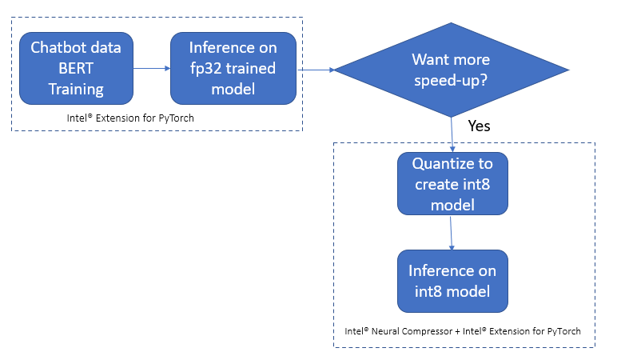

# Customer Care Chatbot

## Introduction
Customers across various industries expect quick and accurate responses to their queries. Artificial Inteligence(AI)-Powered Customer Care Chatbots aim to provide this, but building efficient chatbots that can understand user intent and entities in real-time queries is challenging.

This workflow demonstrates how to construct an AI-Powered Customer Care Chatbot using [Intel's oneAPI AI Analytics Toolkit](https://www.intel.com/content/www/us/en/developer/tools/oneapi/ai-analytics-toolkit.html) to predict user intent and entities in queries. By leveraging Intel's hardware and optimized software, it accelerates the performance of the chatbot. This results in faster and more accurate responses, leading to improved customer satisfaction and more efficient customer support operations.

>Check out more workflow examples in the [Developer Catalog](https://developer.intel.com/aireferenceimplementations).

## Solution Technical Overview

This workflow provides a high-level technical overview of building an AI-Powered Customer Care Chatbot using [Intel® oneAPI AI Analytics Toolkit](https://www.intel.com/content/www/us/en/developer/tools/oneapi/ai-analytics-toolkit.html). Developers can understand why this workflow is relevant, its benefits, and what they will learn by trying it:

- **Relevance to Developers**:
    - This workflow is essential for Natural Language Processing (NLP) and chatbot developers.
    - Developers interested in harnessing Intel's hardware acceleration, especially [Intel® Extension for PyTorch* ](https://pytorch.org/tutorials/recipes/recipes/intel_extension_for_pytorch.html), will find it valuable.

- **Chosen Workflow**:
    - The workflow covers the complete chatbot lifecycle, from training to real-time prediction.
    - It emphasizes integrating Intel's technologies for optimized Machine Learning (ML).

- **What Developers Will Learn**:
    - Setting up an optimized environment for Intel®-accelerated ML.
    - Training NLP chatbots for intent classification and named entity recognition.
    - Leveraging Intel's hardware acceleration for efficient model training and inference.
    - Constructing chatbots that deliver fast and precise responses to customer queries.
    - Hands-on experience with [Intel® oneAPI AI Analytics Toolkit](https://www.intel.com/content/www/us/en/developer/tools/oneapi/ai-analytics-toolkit.html) and PyTorch*  .

This workflow equips developers with the knowledge and tools to create high-performance AI-Powered Customer Care Chatbots, enhancing customer service across various industries.

>For more details, visit the [AI-Powered Customer Care Chatbots](https://github.com/oneapi-src/customer-chatbot) GitHub repository.

## Solution Technical Details
In this section, we describe the code base and how to replicate the results. The included code demonstrates a complete framework for

  1. Setting up a virtual environment for Intel®-accelerated ML
  2. Training an NLP AI-Powered Customer Care Chatbot for intent classification and name entity recognition using PyTorch*/[Intel® Extension for PyTorch*](https://pytorch.org/tutorials/recipes/recipes/intel_extension_for_pytorch.html) 
  3. Predicting from the trained model on new data using PyTorch*/[Intel® Extension for PyTorch* ](https://pytorch.org/tutorials/recipes/recipes/intel_extension_for_pytorch.html)

### **Use Case E2E flow**



#### *Intel® Extension for PyTorch**  

The [Intel® Extension for PyTorch* ](https://pytorch.org/tutorials/recipes/recipes/intel_extension_for_pytorch.html)  extends PyTorch* with optimizations for an extra performance boost on Intel® hardware. Most of the optimizations will be included in stock PyTorch* releases eventually, and the intention of the extension is to deliver up-to-date features and optimizations for PyTorch* on Intel® hardware, examples include AVX-512 Vector Neural Network Instructions (AVX512 VNNI) and Intel® Advanced Matrix Extensions (Intel® AMX).

#### *Intel® Neural Compressor*

[Intel® Neural Compressor](https://www.intel.com/content/www/us/en/developer/tools/oneapi/neural-compressor.html) (INC) is an open-source Python* library designed to help you quickly deploy low-precision inference solutions on popular deep-learning frameworks such as TensorFlow*, PyTorch* , MXNet*, and ONNX* (Open Neural Network Exchange) runtime. The tool automatically optimizes low-precision recipes for deep-learning models to achieve optimal product objectives, such as inference performance and memory usage, with expected accuracy criteria.

## Validated Hardware Details
There are workflow-specific hardware and software setup requirements depending on
how the workflow is run. Bare metal development system and Docker\* image running
locally have the same system requirements.

| Recommended Hardware                                            | Precision
| --------------------------------------------------------------- | ------------
| CPU: Intel® 2nd Gen Xeon® Platinum 8280 CPU @ 2.70GHz or higher | FP32, INT8
| RAM: 187 GB                                                     |
| Recommended Free Disk Space: 20 GB or more                      |

#### Minimal Requirements
* RAM: 16 GB total memory
* CPUs: 4
* Storage: 20GB
* Operating system: Ubuntu\* 22.04 LTS


## How it Works
Intel® oneAPI is used to accelerate results for critical low-latency applications. It provides the capability to reuse the code present in different languages so that hardware utilization is optimized to provide these results.

To reproduce the results in this repository, we describe the following tasks

1. How to create an execution environment which utilizes Intel® versions of libraries
2. How to run the code to benchmark model training
3. How to run the code to benchmark model inference
4. How to quantize trained models using INC 
5. How to benchmark concurrency

## Get Started
Start by **defining an environment variable** that will store the workspace path, this can be an existing directory or one to be created in further steps. This ENVVAR will be used for all the commands executed using absolute paths. 

[//]: # (capture: baremetal)
```bash
export WORKSPACE=$PWD/customer-chatbot
```

Set the following environment variables:

[//]: # (capture: baremetal)
```bash
export DATA_DIR=$WORKSPACE/data
export OUTPUT_DIR=$WORKSPACE/output
export CONFIG_DIR=$WORKSPACE/config
```

### Download the Workflow Repository
Create a working directory for the workflow and clone the [Main Repository](https://github.com/oneapi-src/frameworks.ai.platform.sample-apps.customer-chatbot) repository into your working
directory.

```bash
mkdir -p $WORKSPACE && cd $WORKSPACE
git clone https://github.com/intel-innersource/frameworks.ai.platform.sample-apps.customer-chatbot.git $WORKSPACE
```

Create following directories.

[//]: # (capture: baremetal)
```bash
mkdir -p $OUTPUT_DIR/saved_models/ $DATA_DIR/atis-2/ $OUTPUT_DIR/logs
```

### Set Up Conda*
1. Download the appropriate Miniconda Installer for Linux.

    ```bash
    wget -q https://repo.anaconda.com/miniconda/Miniconda3-latest-Linux-x86_64.sh
    ``` 

2. In your terminal window, run.

    ```bash
    bash Miniconda3-latest-Linux-x86_64.sh
    ```

3. Delete downloaded file.

    ```bash
    rm Miniconda3-latest-Linux-x86_64.sh
    ```

To learn more about Conda* installation, see the [Conda* Linux installation instructions](https://docs.conda.io/projects/conda/en/stable/user-guide/install/linux.html).

### Set Up Environment
Before creating the environments, if you don't already have Anaconda*, install and setup Anaconda* for Linux following this [link](https://www.anaconda.com/products/distribution).

Install and set the libmamba solver as default solver. Run the following commands:

```bash
# If the user wants to set libmamba as conda's default solver 
# for base environment, run the following two lines; if not
# continue executing from to line number 3. Newer versions of 
# Anaconda have libmamba already installed and will be the default
# solver in September 2023.
conda install -n base conda-libmamba-solver
conda config --set solver libmamba
```
The `$WORKSPACE/env/intel_env.yml` file contains all the dependencies to create the intel environment necesary for runnig the workflow. 

Execute the next command to create the Conda* environment.

```bash
conda env create -f $WORKSPACE/env/intel_env.yml
conda activate customer_chatbot_intel
```

Environment setup is required only once. This step does not cleanup the existing environment with the same name hence we need to make sure there is no Conda* environment with the same name. During this setup, `customer_chatbot_intel` Conda* environment will be created with the dependencies listed in the YAML configuration.

#### For Concurrency Benchmarking

For running concurrency benchmarking we will need to install additional dependancies

Apache* Utils will also be needed:
```bash
sudo apt-get install apache2-utils git
```
Model Archiver will be used to produce `.mar` files (this file can then be redistributed and served by anyone using TorchServe*):

[//]: # (capture: baremetal)
```bash
python -m pip install torch-model-archiver captum
```

You then need to clone the TorchServe* repo: 

[//]: # (capture: baremetal)
```bash
export TORCH_SERVE_DIR=$WORKSPACE/src/concurrency_benchmarking/serve
git clone https://github.com/pytorch/serve.git --branch v0.8.2 $TORCH_SERVE_DIR
```

Once the repo has been cloned follow the next steps or follow the steps described at [Quick start with TorchServe*](https://github.com/pytorch/serve#-quick-start-with-torchserve):

[//]: # (capture: baremetal)
```bash
cd $TORCH_SERVE_DIR
python ./ts_scripts/install_dependencies.py
python -m pip install torchserve torch-model-archiver torch-workflow-archiver click-config-file
```

After installing TorchServe*, Apache* Bench is needed in order to run the [benchmarks](https://github.com/pytorch/serve/tree/master/benchmarks#benchmarking-with-apache-bench). Follow the next instructions to install pip dependencies:

[//]: # (capture: baremetal)
```bash
cd $TORCH_SERVE_DIR/benchmarks/
python -m pip install -r requirements-ab.txt
```

### Download the Dataset
The dataset used for this demo is the commonly used Airline Travel Information Systems (ATIS) dataset, which consists of ~5000 utterances of customer requests for flight related details.  Each of these utterances is annotated with the intent of the query and the entities involved within the query. For example, the phrase

> I want to fly from Baltimore to Dallas round trip.

would be classified with the intent of `atis_flight`, corresponding to a flight reservation and the entities would be `Baltimore (fromloc.city_name)`, `Dallas (toloc.city_name)`, and `round_trip (round_trip)`.  

Preprocessing code and data for this repository were originally sourced from https://github.com/sz128/slot_filling_and_intent_detection_of_SLU/tree/master/data/atis-2.

> *Please see this data set's applicable license for terms and conditions. Intel does not own the rights to this data set and does not confer any rights to it.*

The benchmarking scripts expect all of the data files to be present in `data/atis-2/` directory.

Create `atis-2/` directory if not present in `$DATA_DIR`.

[//]: # (capture: baremetal)
```bash
mkdir -p $DATA_DIR/atis-2/
```

To setup the data for benchmarking under these requirements, do the following:

1. Download all of the files from https://github.com/sz128/slot_filling_and_intent_detection_of_SLU/tree/master/data/atis-2 sand save them into the `atis-2` directory.
> *Please see this data set's applicable license for terms and conditions. Intel does not own the rights to this data set and does not confer any rights to it.*


[//]: # (capture: baremetal)
```
cd $DATA_DIR/atis-2/

wget  https://raw.githubusercontent.com/sz128/slot_filling_and_intent_detection_of_SLU/master/data/atis-2/train
wget https://raw.githubusercontent.com/sz128/slot_filling_and_intent_detection_of_SLU/master/data/atis-2/test
wget https://raw.githubusercontent.com/sz128/slot_filling_and_intent_detection_of_SLU/master/data/atis-2/valid
wget https://raw.githubusercontent.com/sz128/slot_filling_and_intent_detection_of_SLU/master/data/atis-2/vocab.intent
wget https://raw.githubusercontent.com/sz128/slot_filling_and_intent_detection_of_SLU/master/data/atis-2/vocab.slot
```
	
2. Combine the `atis-2/train` and `atis-2/valid` files into one called `atis-2/train_all`.  In Linux, this can be done from the current directory using

[//]: # (capture: baremetal)
```shell
cat train valid > train_all
cd $WORKSPACE
```

## Supported Runtime Environment
You can execute the references pipelines using the following environments:
* Bare Metal
* Jupyter Notebook
* Docker*

---

### Run Using Bare Metal
Follow these instructions to set up and run this workflow on your own development system. For running a provided Docker* image with Docker*, see the [Docker* instructions](#run-using-docker).

#### Set Up System Software
Our examples use the ``conda`` package and environment on your local computer. If you don't already have ``conda`` installed, go to [Set Up Conda*](#set-up-conda) or see the [Conda* Linux installation instructions](https://docs.conda.io/projects/conda/en/stable/user-guide/install/linux.html).

#### Run Workflow
To run the benchmarks on a selected configuration, the corresponding environment needs to be setup and activated. For example, to benchmark the model training with ***Intel® oneAPI technologies***, the environment `customer_chatbot_intel` should be activated using:

```bash
conda activate customer_chatbot_intel
```

##### **Running the Benchmarks for Training**

Benchmarking for training can be done using the python script `run_training.py`.

The script *reads and preprocesses the data*, *trains a joint classification and entity recognition model*, and *predicts on unseen test data* using the trained model, while also reporting on the execution time for these 3 steps.  ***Optionally, the script can also save the trained model weights, which is necessary to run the inference benchmarks***.

The run benchmark script takes the following arguments:

```shell
usage: run_training.py [-h] [-l LOGFILE] [-s SAVE_MODEL_DIR] -d DATASET_DIR [--save_onnx]

optional arguments:
  -h, --help            show this help message and exit
  -l LOGFILE, --logfile LOGFILE
                        log file to output benchmarking results to
  -s SAVE_MODEL_DIR, --save_model_dir SAVE_MODEL_DIR
                        directory to save model under
  -d DATASET_DIR, --dataset_dir DATASET_DIR
                        directory to dataset
  --save_onnx           also export an ONNX model
```

Execute `run_training.py` script as follows:

[//]: # (capture: baremetal)
```
python -m intel_extension_for_pytorch.cpu.launch $WORKSPACE/src/run_training.py --logfile $OUTPUT_DIR/logs/intel_train.log -s $OUTPUT_DIR/saved_models/intel -d $DATA_DIR/atis-2/
```

The saved model weights are independent of the technology used. The model is trained using a Bidirectional Encoder Representations from Transformers (BERT) pretrained model with sequence_length = 64, batch_size = 20, epochs = 3. These can be changed within the script.

**Note:**
[Intel® Extension for PyTorch*](https://pytorch.org/tutorials/recipes/recipes/intel_extension_for_pytorch.html) contains many environment specific configuration parameters which can be set using the included CPU launcher tool. Further details for this can be found at https://intel.github.io/intel-extension-for-pytorch/1.11.200/tutorials/performance_tuning/launch_script.html.  While the above command sets many parameters automatically, for our specific environment (D4v5), we benchmark with the following command.

[//]: # (capture: baremetal)
```shell
OMP_NUM_THREADS=4 KMP_BLOCKTIME=50 python -m intel_extension_for_pytorch.cpu.launch --disable_numactl $WORKSPACE/src/run_training.py --logfile $OUTPUT_DIR/logs/intel_train.log -s $OUTPUT_DIR/saved_models/intel -d $DATA_DIR/atis-2/
```

##### **Running the Benchmarks for Inference**

Benchmarking for inference for PyTorch* (.pt) models can be done using the python script `run_inference.py`.

`run_inference.py` : runs inference benchmarks using models optimized by [Intel® Extension for PyTorch* ](https://pytorch.org/tutorials/recipes/recipes/intel_extension_for_pytorch.html).

The `run_inference.py` script takes the following arguments:

```shell
usage: run_inference.py [-h] -s SAVED_MODEL_DIR [--is_jit] [--is_inc_int8] [-b BATCH_SIZE] -d
                        DATASET_DIR [-l LENGTH] [--logfile LOGFILE] [-n N_RUNS]

optional arguments:
  -h, --help            show this help message and exit
  -s SAVED_MODEL_DIR, --saved_model_dir SAVED_MODEL_DIR
                        directory of saved model to benchmark.
  --is_jit              if the model is torchscript. defaults to False.
  --is_inc_int8         saved model dir is a quantized int8 model. defaults to False.
  -b BATCH_SIZE, --batch_size BATCH_SIZE
                        batch size to use. defaults to 200.
  -d DATASET_DIR, --dataset_dir DATASET_DIR
                        directory to dataset
  -l LENGTH, --length LENGTH
                        sequence length to use. defaults to 512.
  --logfile LOGFILE     logfile to use.
  -n N_RUNS, --n_runs N_RUNS
                        number of trials to test. defaults to 100.
```

As attention based models are independent of the sequence length, we can test on different sequence lengths without introducing new parameters.  Both scripts run `n` times and prints the average time taken to call the predict on a batch of size `b` with sequence lenght `l`.

To run benchmarks on the oneAPI PyTorch* execution engine, use:

[//]: # (capture: baremetal)
```shell
python -m intel_extension_for_pytorch.cpu.launch $WORKSPACE/src/run_inference.py -s $OUTPUT_DIR/saved_models/intel --batch_size 200 --length 512 --n_runs 5 --logfile $OUTPUT_DIR/logs/intel_bench.log -d $DATA_DIR/atis-2/
```

**Note:**
[Intel® Extension for PyTorch* ](https://pytorch.org/tutorials/recipes/recipes/intel_extension_for_pytorch.html) contains many environment specific configuration parameters which can be set using the included CPU launcher tool.  Further details for this can be found at https://intel.github.io/intel-extension-for-pytorch/1.11.200/tutorials/performance_tuning/launch_script.html.  While the above command sets many parameters automatically, for our specific environment (D4v5), we benchmark with the following command.

[//]: # (capture: baremetal)
```shell
OMP_NUM_THREADS=4 KMP_BLOCKTIME=50 python -m intel_extension_for_pytorch.cpu.launch --disable_numactl $WORKSPACE/src/run_inference.py -s $OUTPUT_DIR/saved_models/intel --batch_size 200 --length 512 --n_runs 5 --logfile $OUTPUT_DIR/logs/intel_bench.log -d $DATA_DIR/atis-2/

OMP_NUM_THREADS=4 KMP_BLOCKTIME=50 python -m intel_extension_for_pytorch.cpu.launch --disable_numactl $WORKSPACE/src/run_inference.py -s $OUTPUT_DIR/saved_models/intel --batch_size 1 --length 512 --n_runs 1000 --logfile $OUTPUT_DIR/logs/intel_bench.log -d $DATA_DIR/atis-2/
```

##### **Quantization**

Quantization is the practice of converting the FP32 weights in deep neural networks to a 
lower precision, such as INT8 in order **to accelerate computation time and reduce storage
space of trained models**.  This may be useful if latency and throughput are critical.  Intel® 
offers multiple algorithms and packages for quantizing trained models. In this repo, we 
include scripts to quantize the AI Chatbot model using [Intel® Neural Compressor](https://www.intel.com/content/www/us/en/developer/tools/oneapi/neural-compressor.html).

##### Intel® Neural Compressor Quantization

A trained model from the `run_training.py` script above can be quantized 
using [Intel® Neural Compressor](https://www.intel.com/content/www/us/en/developer/tools/oneapi/neural-compressor.html) 
through the `run_quantize_inc.py` script.  This converts the model from FP32 to INT8 while trying to 
maintain a specified level of accuracy specified via a `config.yaml` file. A simple `config.yaml` has been 
provided for basic accuracy aware quantization though several further options exist and can be explored in the link above.


```shell
usage: run_quantize_inc.py [-h] -s SAVED_MODEL -o OUTPUT_DIR [-l LENGTH] [-q QUANT_SAMPLES] -c INC_CONFIG -d DATASET_DIR

optional arguments:
  -h, --help            show this help message and exit
  -s SAVED_MODEL, --saved_model SAVED_MODEL
                        saved pytorch (.pt) model to quantize.
  -o OUTPUT_DIR, --output_dir OUTPUT_DIR
                        directory to save quantized model to.
  -l LENGTH, --length LENGTH
                        sequence length to use. defaults to 512.
  -q QUANT_SAMPLES, --quant_samples QUANT_SAMPLES
                        number of samples to use for quantization. defaults to 100.
  -c INC_CONFIG, --inc_config INC_CONFIG
                        INC conf yaml.
  -d DATASET_DIR, --dataset_dir DATASET_DIR
                        directory to dataset
```

A workflow of "training -> INC quantization -> inference" benchmarking may look like

[//]: # (capture: baremetal)
```shell
# run training, outputs as $OUTPUT_DIR/saved_models/intel/convai.pt
python -m intel_extension_for_pytorch.cpu.launch $WORKSPACE/src/run_training.py -s $OUTPUT_DIR/saved_models/intel --logfile $OUTPUT_DIR/logs/intel_train.log -d $DATA_DIR/atis-2/

# quantize the trained model, outputs into the $OUTPUT_DIR/saved_models/intel_int8/best_model.pt directory
python $WORKSPACE/src/run_quantize_inc.py -s $OUTPUT_DIR/saved_models/intel/convai.pt -o $OUTPUT_DIR/saved_models/intel_int8/ -c $CONFIG_DIR/config.yml -d $DATA_DIR/atis-2/

# benchmark the non-quantized model using intel
python -m intel_extension_for_pytorch.cpu.launch $WORKSPACE/src/run_inference.py -s $OUTPUT_DIR/saved_models/intel/ -b 1 -n 1000 --logfile $OUTPUT_DIR/logs/intel_bench.log -d $DATA_DIR/atis-2/

# benchmark the quantized model using intel
python -m intel_extension_for_pytorch.cpu.launch $WORKSPACE/src/run_inference.py -s $OUTPUT_DIR/saved_models/intel_int8/ -b 1 -n 1000 --is_inc_int8 --logfile $OUTPUT_DIR/logs/intel_bench_quant.log -d $DATA_DIR/atis-2/
```

##### Concurrency

A critical aspect of good AI Chatbots is their ability to quickly respond to multiple independent customer queries.  From a technical perspective, this is a question of how well these models can be run to handle concurrency on a single server.

In order to benchmark this, we need to do the following

1. Package trained/optimized models using torch-model-archiver
2. Deploy a trained model to use TorchServe*
3. Run the TorchServe* benchmarks using apache bench
4. Collect the reports of the TorchServe* benchmark


##### **Preparing the model for benchmarking**

#### **1. Convert the model to TorchScript***

To use the trained models in torch-serve, they first need to be converted to a TorchScript* model.  To do this, use the `convert_jit.py` script

```shell
usage: convert_jit.py [-h] -s SAVED_MODEL_DIR -o OUTPUT_MODEL [--is_inc_int8]

optional arguments:
  -h, --help            show this help message and exit
  -s SAVED_MODEL_DIR, --saved_model_dir SAVED_MODEL_DIR
                        directory of saved model to benchmark.
  -o OUTPUT_MODEL, --output_model OUTPUT_MODEL
                        saved torchscript (.pt) model
  -d DATASET_DIR, --dataset_dir DATASET_DIR
                        directory to dataset
  --is_inc_int8         saved model dir is a quantized int8 model. defaults to False.
```

If the model is not quantized using INC and assuming the saved model is saved in the `$OUTPUT_DIR/saved_models/intel` directory:

[//]: # (capture: baremetal)
```shell
python $WORKSPACE/src/convert_jit.py -s $OUTPUT_DIR/saved_models/intel -o $OUTPUT_DIR/saved_models/intel/convai_jit.pt -d $DATA_DIR/atis-2/
```
which will convert the saved model into a TorchScript* model called `convai_jit.pt`.

If the model is quantized using INC, we need to specify the flag `--is_inc_int8` and then use:

[//]: # (capture: baremetal)
```shell
python $WORKSPACE/src/convert_jit.py -s $OUTPUT_DIR/saved_models/intel_int8 -o $OUTPUT_DIR/saved_models/intel_int8/convai_jit.pt --is_inc_int8 -d $DATA_DIR/atis-2/
```

#### **2. Package the TorchScript* model using torch-model-archiver**

After creating a TorchScript* model, the trained model needs to be packaged to a `.mar` file using torch-model-archiver.  Assuming the serialized model is saved as `convai_jit.pt` in the current directory, a sample command to do this is:

[//]: # (capture: baremetal)
```shell
torch-model-archiver --model-name convai --export-path $OUTPUT_DIR/saved_models/intel --version 1.0 --serialized-file $OUTPUT_DIR/saved_models/intel/convai_jit.pt --handler $WORKSPACE/src/concurrency_benchmarking/custom_handler.py
```
Or if working with the quantized model, use:

[//]: # (capture: baremetal)
```bash
torch-model-archiver --model-name convai --export-path $OUTPUT_DIR/saved_models/intel_int8 --version 1.0 --serialized-file $OUTPUT_DIR/saved_models/intel_int8/convai_jit.pt --handler $WORKSPACE/src/concurrency_benchmarking/custom_handler.py
```

This will create a file called `convai.mar` which can be used to deploy to TorchServe*.  

### Benchmarking using the TorchServe*-benchmarking script

To benchmark this model using the [TorchServe* benchmarking tools](https://github.com/pytorch/serve/tree/master/benchmarks#benchmarking-with-apache-bench),

1. Copy the `config.json` file and the `config.properties` file into the cloned `serve/benchmarks` directory:
    
    [//]: # (capture: baremetal)
    ```shell
    cp $CONFIG_DIR/config.properties $TORCH_SERVE_DIR/benchmarks/config.properties
    cp $CONFIG_DIR/config.json $TORCH_SERVE_DIR/benchmarks/config.json
    ```

2. Modify the [config.json](#configjson) and [config.properties](#configproperties) to point to the relevant files and the desired experimental parameters, e.g.:

    [//]: # (capture: baremetal)
    ```bash
    sed -i "s|file:///PATH_TO_MAR|file://${OUTPUT_DIR}/saved_models/intel/convai.mar|" $TORCH_SERVE_DIR/benchmarks/config.json
    sed -i "s|PATH_TO_INPUT_FILE|${WORKSPACE}/src/concurrency_benchmarking/input_data.json|" $TORCH_SERVE_DIR/benchmarks/config.json
    sed -i "s|PATH_TO_CONFIG_PROPERTIES|${WORKSPACE}/src/concurrency_benchmarking/serve/benchmarks/config.properties|" $TORCH_SERVE_DIR/benchmarks/config.json
    ```
    Or if using the quantized model:

    ```bash
    sed -i "s|file:///PATH_TO_MAR|file://${OUTPUT_DIR}/saved_models/intel_int8/convai.mar|" $TORCH_SERVE_DIR/benchmarks/config.json
    sed -i "s|PATH_TO_INPUT_FILE|${WORKSPACE}/src/concurrency_benchmarking/input_data.json|" $TORCH_SERVE_DIR/benchmarks/config.json
    sed -i "s|PATH_TO_CONFIG_PROPERTIES|${WORKSPACE}/src/concurrency_benchmarking/serve/benchmarks/config.properties|" $TORCH_SERVE_DIR/benchmarks/config.json
    ```
    We included a simple `input_data.json` file to provide a test input for running the benchmarks.
3. Run the benchmark using:
   
    [//]: # (capture: baremetal)
    ```shell
    PATH=$CONDA_PREFIX/bin/:$PATH python $TORCH_SERVE_DIR/benchmarks/benchmark-ab.py --config $TORCH_SERVE_DIR/benchmarks/config.json
    ```
The reports should be stored in the temporary directory `/tmp/benchmark`.  Measurements for latency and throughput can be found in the file `/tmp/benchmark/ab_report.csv`.

#### config.json

The available fields for the `config.json` file, as an example, are: 

```python
{'url': "file:///PATH_TO_MAR",
'gpus': '',
'exec_env': 'local',
'batch_size': 1,
'batch_delay': 200,
'workers': 1,
'concurrency': 10,
'requests': 100,
'input': 'PATH_TO_INPUT',
'content_type': 'application/json',
'image': '',
'docker_runtime': '',
'backend_profiling': False,
'config_properties': 'PATH_TO_CONFIG_PROPERTIES',
'inference_model_url': 'predictions/benchmark',
```

### config.properties

The `config.properties` file adjusts the parameters for the TorchServe* server.

The two most important fields are to either enable or disable Intel® Extension for PyTorch*
Extensions using

```shell
ipex_enable=true
cpu_launcher_enable=true
```

#### Clean Up Bare Metal

Follow these steps to restore your ``$WORKSPACE`` directory to an initial step. Please note that all downloaded dataset files, Conda* environment created, and logs created by workflow will be deleted. Before executing next steps back up your important files.


```bash
conda deactivate
conda remove --name customer_chatbot_intel --all -y
```

[//]: # (capture: baremetal)
```bash
rm -rf $OUTPUT_DIR/saved_models/ $DATA_DIR/atis-2/ $OUTPUT_DIR/logs $TORCH_SERVE_DIR
```

### Run using Jupyter Notebook
Follow the instructions described on [Get Started](#get-started) to set required environment variables.

Execute [Set Up Conda*](#set-up-conda) and [Set Up environment](#set-up-environment) steps.

To be able to run GettingStarted.ipynb the Conda* environment must install additional packages:
```bash
conda activate customer_chatbot_intel
conda install -c intel nb_conda_kernels jupyter notebook -y
cd $WORKSPACE
jupyter notebook
```
Open Jupyter Notebook in a web browser, select GettingStarted.ipynb and select conda env:customer_chatbot_intel as the jupyter kernel. Now you can follow the notebook's instructions step by step.

#### Clean Up Jupyer Notebook
To clean Jupyter Notebook follow the instructions described in [Clean Up Bare Metal](#clean-up-bare-metal).

### Run Using Docker*
Follow these instructions to set up and run our provided Docker* image.
For running on bare metal, see the [bare metal instructions](#run-using-bare-metal).

#### Set Up Docker* Engine
You will need to install Docker* Engine on your development system.
Note that while **Docker* Engine** is free to use, **Docker* Desktop** may require you to purchase a license. See the [Docker* Engine Server installation instructions](https://docs.docker.com/engine/install/#server) for details.

#### Setup Docker* Compose
Ensure you have Docker* Compose installed on your machine. If you don't have this tool installed, consult the official [Docker* Compose installation documentation](https://docs.docker.com/compose/install/linux/#install-the-plugin-manually).

```bash
DOCKER_CONFIG=${DOCKER_CONFIG:-$HOME/.docker}
mkdir -p $DOCKER_CONFIG/cli-plugins
curl -SL https://github.com/docker/compose/releases/download/v2.7.0/docker-compose-linux-x86_64 -o $DOCKER_CONFIG/cli-plugins/docker-compose
chmod +x $DOCKER_CONFIG/cli-plugins/docker-compose
docker compose version
```

#### Set Up Docker* Image
If your environment requires a proxy to access the internet, export your
development system's proxy settings to the Docker* environment at `docker-compose.yml` file.

1. Follow the instructions described on [Get Started](#get-started) to set required environment variables.

2. Add next environment variables used to build and run the Docker* image:

    ```bash
    export PORT=8888 # port used by jupyter server
    export COMPOSE_PROJECT_NAME=customer_chatbot
    ```

3. Build the Docker* image using docker-compose.yml file provided in `docker` directory:

    ```bash
    cd $WORKSPACE/docker
    docker compose build
    ```

#### Run Workflow
We provide a dockerfile and docker-compose file to quickly and easily build a container with everything necessary to be able to run the workflow. Instructions can be found in [docker folder](docker/README.md)

1. Execute next commands to run the image and start a new bash session inside the container:
    ```bash
    cd $WORKSPACE/docker
    docker compose -p ${USER} run jupyter_server bash
    ```
3. Execute [Running the benchmarks](#run-workflow) steps.

#### Clean Up Docker* Containers
1. Follow these clean steps inside the Docker* container.

    ```bash
    cd $WORKSPACE/docker
    docker compose down
    ```

### Expected Output
Training output is stored in `$OUTPUT_DIR/logs` directory. You can see information on training time and training loss and accuracy per epoch. The final information should look similarly to below:
```bash
INFO - =======> Test Accuracy on NER : 0.94
INFO - =======> Test Accuracy on CLS : 0.91
INFO - =======> Training Time : 309.539 secs
INFO - =======> Inference Time : 5.648 secs
INFO - =======> Total Time: 315.187 secs
```

Benchmark results are stored in the `$OUTPUT_DIR/logs` directory. It includes a progress bar of the benchmark progress followed by the average time per batch like below:
```bash
INFO - Avg time per batch : 19.659 s
```

Quantization results are stored in the `$OUTPUT_DIR/logs` directory. It includes statistics of the quitized models accuracy and latency compared to the baseline model such as below:
```bash
[INFO] FP32 baseline is: [Accuracy: 0.9443, Duration (seconds): 15.7158]
[INFO] |******Mixed Precision Statistics******|
[INFO] +-----------------+----------+---------+
[INFO] |     Op Type     |  Total   |   INT8  |
[INFO] +-----------------+----------+---------+
[INFO] |    Embedding    |    3     |    3    |
[INFO] |      Linear     |    75    |    75   |
[INFO] +-----------------+----------+---------+
[INFO] Pass quantize model elapsed time: 1495.84 ms
[INFO] Tune 1 result is: [Accuracy (int8|fp32): 0.9302|0.9443, Duration (seconds) (int8|fp32): 7.5332|15.7158], Best tune result is: [Accuracy: 0.9302, Duration (seconds): 7.5332]
[INFO] |**********************Tune Result Statistics**********************|
[INFO] +--------------------+----------+---------------+------------------+
[INFO] |     Info Type      | Baseline | Tune 1 result | Best tune result |
[INFO] +--------------------+----------+---------------+------------------+
[INFO] |      Accuracy      | 0.9443   |    0.9302     |     0.9302       |
[INFO] | Duration (seconds) | 15.7158  |    7.5332     |     7.5332       |
[INFO] +--------------------+----------+---------------+------------------+
```


## Summary and Next Steps
In this example, we focus on leveraging the [Intel® oneAPI AI Analytics Toolkit](https://www.intel.com/content/www/us/en/developer/tools/oneapi/ai-analytics-toolkit.html) on the task of training and deploying an accurate AI system to predict the Intent and Entities of a user query.

Using Intel® technologies can result in more efficient model experimentation and more robust deployed AI solutions, even when using state-of-the-art Deep Learning based NLP models.


## Learn More
For more information about or to read about other relevant workflow examples, see these guides and software resources:

- [PyTorch*](https://pytorch.org/get-started/locally/)
- [TorchServe* benchmarking tools](https://github.com/pytorch/serve/tree/master/benchmarks#benchmarking-with-apache-bench)
- [Conda* Linux installation instructions](https://docs.conda.io/projects/conda/en/stable/user-guide/install/linux.html)
- [Docker* Engine Server installation instructions](https://docs.docker.com/engine/install/#server)
- [Docker* Compose installation documentation](https://docs.docker.com/compose/install/linux/#install-the-plugin-manually)
- [Intel® AI Analytics Toolkit (AI Kit)](https://www.intel.com/content/www/us/en/developer/tools/oneapi/ai-analytics-toolkit.html)
- [Intel® oneAPI AI Analytics Toolkit](https://www.intel.com/content/www/us/en/developer/tools/oneapi/ai-analytics-toolkit.html)
- [Intel® Extension for PyTorch* ](https://pytorch.org/tutorials/recipes/recipes/intel_extension_for_pytorch.html)
- [Intel® Neural Compressor](https://www.intel.com/content/www/us/en/developer/tools/oneapi/neural-compressor.html)
- [Intel® Distribution for Python*](https://www.intel.com/content/www/us/en/developer/tools/oneapi/distribution-for-python.html)

## Support
If you have questions or issues about this use case, want help with troubleshooting, want to report a bug or submit enhancement requests, please submit a GitHub issue.

## Appendix

\*Other names and brands that may be claimed as the property of others. [Trademarks](https://www.intel.com/content/www/us/en/legal/trademarks.html).

To the extent that any public or non-Intel datasets or models are referenced by or accessed using tools or code on this site those datasets or models are provided by the third party indicated as the content source. Intel does not create the content and does not warrant its accuracy or quality. By accessing the public content, or using materials trained on or with such content, you agree to the terms associated with that content and that your use complies with the applicable license.
Intel expressly disclaims the accuracy, adequacy, or completeness of any such public content, and is not liable for any errors, omissions, or defects in the content, or for any reliance on the content. Intel is not liable for any liability or damages relating to your use of public content.

